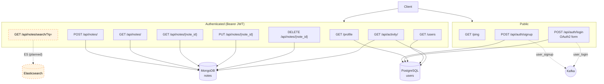
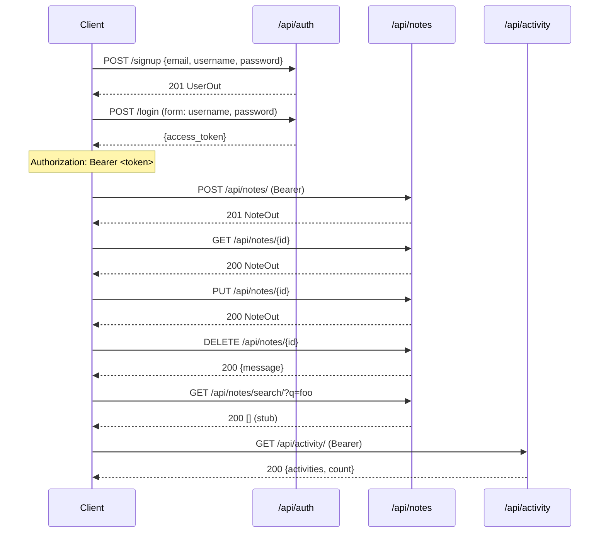

# ColabNote — API Endpoints

All routes are served by `app/main.py` and mounted under `/api` (except the top-level `/ping`, `/profile`, `/users`).

## Endpoint map

## Endpoint reference

Legend: **Auth** = bearer JWT required · **Kafka** = publishes an event · **Store** = backend hit on the request path

### Top-level (`app/main.py`)

| Method | Path       | Auth | Request                | Response                  | Store |
| ------ | ---------- | ---- | ---------------------- | ------------------------- | ----- |
| GET    | `/ping`    | no   | —                      | `{status, message}`       | —     |
| GET    | `/profile` | yes  | —                      | `UserOut`                 | PG    |
| GET    | `/users`   | yes  | —                      | `list[UserOut]`           | PG    |

### Auth (`/api/auth`, `app/routers/auth.py`)

| Method | Path                  | Auth | Request / Form                                                  | Response      | Store | Kafka             |
| ------ | --------------------- | ---- | --------------------------------------------------------------- | ------------- | ----- | ----------------- |
| POST   | `/api/auth/signup`    | no   | JSON `{email, username, password}` (`UserCreate`)               | `UserOut` 201 | PG    | `user_signup`     |
| POST   | `/api/auth/login`     | no   | OAuth2 form: `username`, `password` (`OAuth2PasswordRequestForm`) | `Token`       | PG    | `user_login`      |

> `signup` returns the created user; `login` returns `{access_token, token_type: "bearer"}` (JWT HS256, `sub=email`, 30 min default).

### Notes (`/api/notes`, `app/routers/notes.py`)

| Method | Path                       | Auth | Request                                            | Response        | Store | Kafka |
| ------ | -------------------------- | ---- | -------------------------------------------------- | --------------- | ----- | ----- |
| POST   | `/api/notes/`              | yes  | JSON `{title, content}` (`NoteCreate`)             | `NoteOut` 201   | Mongo | —     |
| GET    | `/api/notes/`              | yes  | —                                                  | `list[NoteOut]` | Mongo | —     |
| GET    | `/api/notes/search/?q=…`   | yes  | query `q`                                          | `[]` (stub)     | ES (planned) | `log_note_searched` (planned) |
| GET    | `/api/notes/{note_id}`     | yes  | path `note_id`                                     | `NoteOut` 404 if missing | Mongo | — |
| PUT    | `/api/notes/{note_id}`     | yes  | JSON partial `{title?, content?}` (`NoteUpdate`)   | `NoteOut`       | Mongo | —     |
| DELETE | `/api/notes/{note_id}`     | yes  | path `note_id`                                     | `{message}` 404 if missing | Mongo | — |

> The `notes` router decodes the JWT itself (`get_current_user_email` in-module) and uses `email` to scope every query. **Create / update / delete publish Kafka events, update Elasticsearch, and manage Redis cache** via `BackgroundTasks`.

### Activity (`/api/activity`, `app/routers/activity.py`)

| Method | Path              | Auth | Request | Response                                                                                  | Store              |
| ------ | ----------------- | ---- | ------- | ----------------------------------------------------------------------------------------- | ------------------ |
| GET    | `/api/activity/`  | yes  | —       | `{activities: [...], count}` — last 20 `activity_logs` for the user, sorted by timestamp desc | Mongo (`activity_logs`) + PG (user lookup) |

Each activity entry: `{event_type, user_id, resource_id, timestamp, metadata}`.

## Auth flow at a glance

