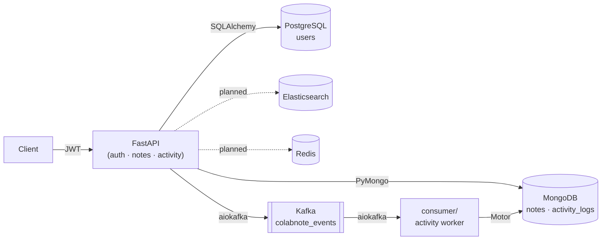

# ColabNote Architecture

## System Overview

ColabNote is a production-grade collaborative notes API built on a polyglot persistence model. The system consists of eight layers working together to provide REST and GraphQL interfaces for authenticated note management.

## Architecture Diagram



## Request Lifecycle

### Authentication Flow

1. Client sends `POST /api/auth/signup` with `{email, username, password}`
2. Password is hashed with bcrypt via `passlib`
3. User record is stored in PostgreSQL via SQLAlchemy
4. A `user_signup` event is published to Kafka (non-blocking)
5. Client receives `201` with `UserOut`
6. Client sends `POST /api/auth/login` with credentials
7. Password is verified; JWT (HS256) is created with `sub=email`
8. A `user_login` event is published to Kafka
9. Client receives `{access_token, token_type: "bearer"}`

### Notes CRUD Flow

1. Authenticated client sends request with `Authorization: Bearer <token>`
2. Token is decoded to extract user email
3. Notes are stored in MongoDB (notes collection), scoped by `user_email`
4. On create/update/delete:
   - Elasticsearch index is updated (via `BackgroundTasks`)
   - Redis cache is invalidated/updated (via `BackgroundTasks`)
   - Kafka event is published (non-blocking)
5. On read by ID: Redis is checked first (cache HIT), MongoDB fallback (cache MISS)

### Activity Feed Flow

1. API publishes events to Kafka topic `colabnote_events`
2. Consumer service (`consumer/consumer.py`) reads from Kafka
3. Consumer writes each event as a document to MongoDB `activity_logs` collection
4. Client queries `GET /api/activity/` to retrieve last 20 events

### Search Flow

1. Client sends `GET /api/notes/search/?q=<query>`
2. Elasticsearch performs fuzzy multi-match search on `title` (boosted 3x) and `content`
3. Results are scoped to the authenticated user via `user_email` filter
4. Results include highlighted snippets and relevance scores
5. Results are cached in Redis for subsequent identical queries

## Data Flow

```
Client → Nginx (load balancer) → FastAPI (×2 instances)
  ├── PostgreSQL (users, auth)
  ├── MongoDB (notes, activity_logs)
  ├── Elasticsearch (full-text search index)
  ├── Redis (cache layer)
  └── Kafka → Consumer → MongoDB (activity logs)
```

## Key Design Decisions

### 1. Polyglot Persistence
Different data stores are used for different concerns: PostgreSQL for relational user data, MongoDB for document-oriented notes, Elasticsearch for full-text search, and Redis for caching. This follows the pattern used by real-world systems at companies like Notion and Confluence.

### 2. Async Event-Driven Architecture
Kafka is used as an event bus to decouple the API from the activity logging consumer. This ensures that publishing activity events doesn't block the API response path.

### 3. BackgroundTasks for Side-Effects
Elasticsearch indexing and Redis cache operations are dispatched via FastAPI's `BackgroundTasks` to avoid adding latency to the critical request path.

### 4. Dual Interface (REST + GraphQL)
The same data is exposed through both REST endpoints and a GraphQL endpoint (`/graphql`), allowing clients to choose the appropriate interface for their needs.

## Service Inventory

| Service | Image | Port | Role |
|---------|-------|------|------|
| PostgreSQL | postgres:16 | 5432 | User profiles and auth |
| MongoDB | mongo:7 | 27017 | Notes and activity logs |
| Elasticsearch | elasticsearch:8.11.0 | 9200 | Full-text search |
| Redis | redis:7-alpine | 6379 | Caching |
| Kafka | confluentinc/cp-kafka:7.6.0 | 9092 | Event streaming |
| Consumer | custom (consumer/Dockerfile) | — | Activity log worker |
| API (×2) | custom (Dockerfile) | 8001, 8002 | FastAPI application |
| Nginx | nginx:1.27-alpine | 80 | Load balancer |